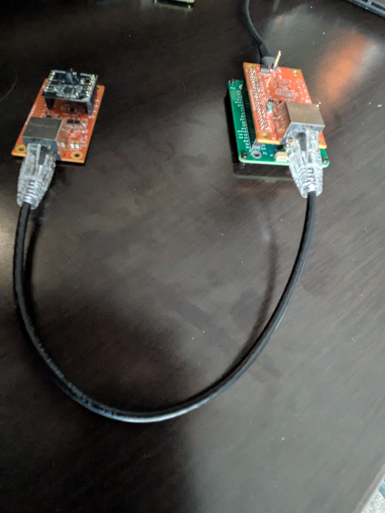
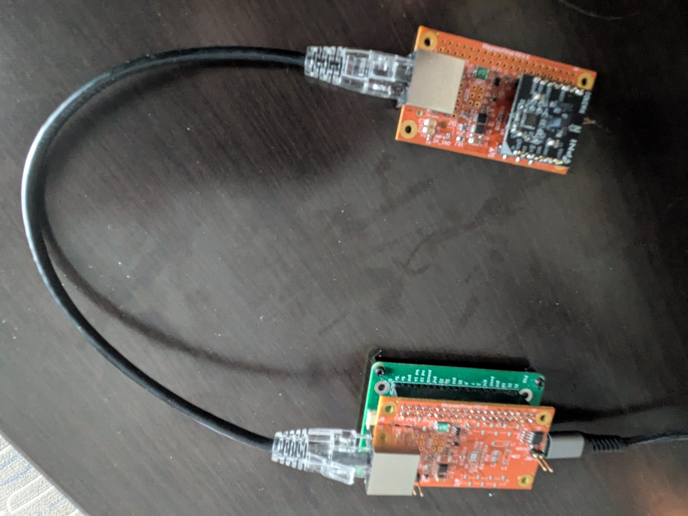
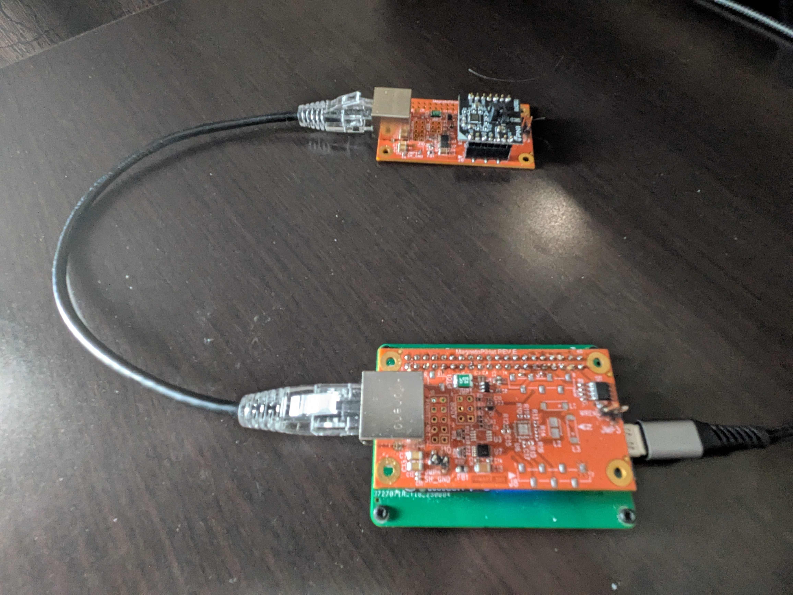

# Hardware Setup

This guide helps you connect the Pololu USB-to-I²C adapter to the RM3100-based sensor and prepare your Linux system.

## Hardware
- Pololu Isolated USB-to-I²C Adapter:
  - 5397 (with isolated power output)
- RM3100 magnetometer board (e.g., TAPR/TangerineSDR magnetometer)
- Appropriate wiring for SDA, SCL, GND, and optional +5V


*Fig. 1: Pololu USB-to-I²C adapter connected to the RM3100 magnetometer sensor.*

## Wiring
- Connect:
  - SDA ↔ SDA
  - SCL ↔ SCL
  - GND ↔ GND
  - +5V (the USB C connection must providepowre at or near +5V to power the remote sensors and overcome resistive losses.)


*Fig. 2: Close-up of the sensor wiring and connector pinout.*


*Fig. 2a: Detail of the Pololu adapter connections.*
- Confirm pull-ups are present on SDA/SCL (many boards include them).

## Linux device path
- The adapter appears as a ttyACM device (e.g., /dev/ttyACM0).
- The full setup should configue a device named /dev/ttyMAG0 that symlinks to the correct ACM device, but you can also use the ACM path directly.
- If the adapter doesn't appear, try replugging it and check dmesg or lsusb for clues. You should see a new device with a name like "Pololu USB-to-I²C Adapter" and an associated ACM device number.
- Check dmesg or lsusb for details; examples are in assets.

## Stable permissions and naming
- A sample udev rule is provided at install/99-PololuI2C.rules. To install:
```
sudo cp install/99-PololuI2C.rules /etc/udev/rules.d/
sudo udevadm control --reload-rules
sudo udevadm trigger
```
- After replugging the adapter, confirm permissions and any symlink names defined in your rule.

## Verifying connectivity
- Use mag-usb's quick check flag:
```
./mag-usb -Q                      # uses default /dev/ttyMAG0
./mag-usb -O /dev/ttyACM0 -Q      # override if udev rule not installed
```
- If you see permission errors, check your udev setup and group membership (dialout or equivalent on your distro), or run temporarily with sudo (not recommended long-term).
