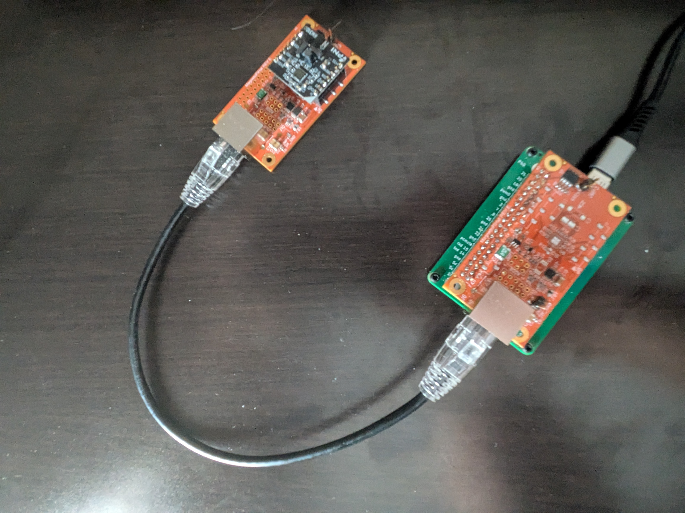
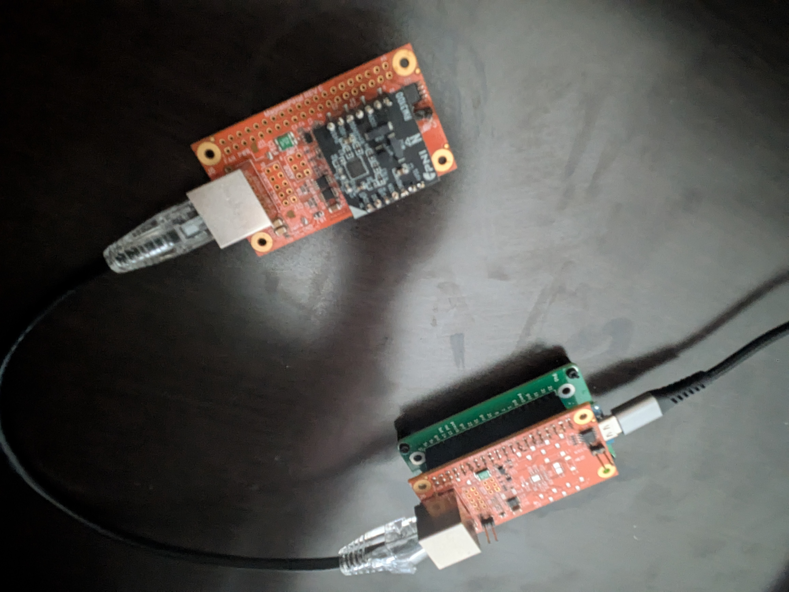

# Troubleshooting

Common issues and how to resolve them.

## Adapter not found or permission denied
- If you are using an external USB port hub, make certain that it provides the full 5v required by the Pololu adapter. It may require a supplemental power supply to power the device.
- Be certain that the switchon the Pololu device is in the 5v position and that **_both_** the **BLUE** and the **GREEN** LEDs are visible.

*Fig. 5: Pololu adapter LED indicators and 5V switch position.*
- Symptom: `mag-usb -Q` reports errors opening `/dev/ttyACM0`, or EACCES.
- Fixes:
  - Ensure your user is in the dialout (or equivalent) group: `sudo usermod -aG dialout $USER` then re-login.
  - Install udev rule: see docs/Hardware-Setup.md and install/99-PololuI2C.rules.
  - Verify the device node exists: `ls -l /dev/ttyACM*`.
  - Check dmesg: `dmesg | tail -n 50`.

## Wrong device path (ACM1 vs ACM0)
- The ttyACM number can change. Either probe available devices or create a persistent symlink via udev.
- Use `-O /dev/ttyACM<N>` to select the correct device.

## Missing or ignored configuration
- Symptom: `-P` shows defaults instead of your values.
- Causes and fixes:
  - `config.toml` is not in the current working directory. Run from the folder containing `config.toml`, or pass an absolute path (feature not currently implemented; current build only checks CWD).
  - Syntax errors: ensure `key = value` format, quoted strings, and whole-line comments only (no inline comments).

## Invalid orientation values
- Symptom: Orientation prints as `0, 0, 0` or axis swaps don’t match expectations.
- Notes:
  - Allowed values are only `-180, -90, 0, 90, 180`. Any other value is treated as `0`.
  - Rotations are applied in order X → Y → Z using the right-hand rule. See docs/Orientation-and-Axes.md for examples.

## Build fails
- Ensure CMake 3.22+ and a recent GCC/Clang.
- Try a clean build directory.
- If errors are warnings-as-errors, you can temporarily disable `-DENABLE_WERROR=ON`.

## Tests fail
- Some tests interact with the i2c-pololu logic; ensure the adapter is not locked by another process.
- Re-run with verbose CTest: `(cd build && ctest -VV)`.

## No data from sensor
- Check wiring (SDA/SCL/GND, optional 5V).

*Fig. 6: Verifying sensor wiring connections.*
- Confirm pull-up resistors present.
- Verify device addresses match expected values in config (MCP9808/Magnetometer addresses).
- Use diagnostics:
  - `-Q` to verify the Pololu adapter.
  - `-S` to scan the I²C bus.
  - `-M` to verify the magnetometer.
  - `-T` to verify the temperature sensor.

## Interleaved JSON and logs
- If you require a clean JSON stream, redirect  (`2>/dev/null`) or filter lines that do not start with `{`.

## Getting more help
- Open an issue with logs:
  - Your distro and kernel version
  - Output of `lsusb`, `dmesg` after plugging the adapter
  - mag-usb CLI, version, and full console output
